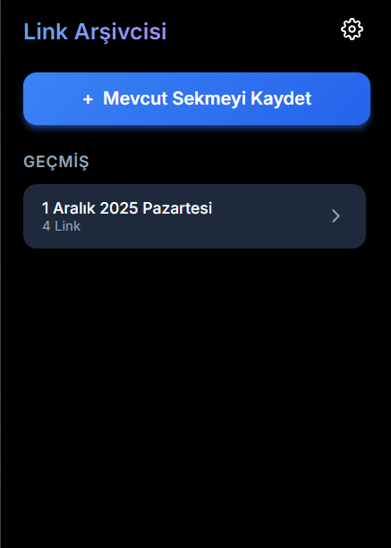
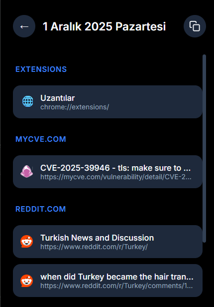
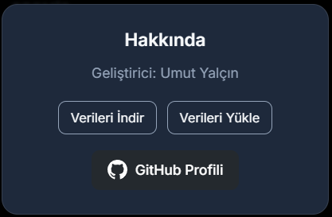

# Seçtiğiniz sekmeleri günü gününe bir klasörde tutmak için Chrome Web eklentisi / Chrome Web extension to keep selected tabs in a folder day by day

    

---

## Eklenti ile alakalı ekran görüntüleri / Screenshots related to the extension

    
    
    

---

### 🚀 Proje Hakkında: Sekme Kaosuna Son! (TR)

Yoğun çalıştığınız veya araştırma yaptığınız günlerde, tarayıcınız yüzlerce sekmeyle dolup taşabilir. **Günübirlik Sekme Arşivleyici** eklentisi, bu dağınıklığa pratik bir çözüm sunar.

* **Tek Tıkla Arşivleme:** Seçtiğiniz tüm sekmeleri, o günün tarihini taşıyan otomatik bir yer imi klasörüne taşır. (Örn: `2025-12-01 Arşivi`)
* **Odaklanma:** Gereksiz sekmeleri tek bir hareketle kapatarak tarayıcı performansınızı artırır ve dikkatinizi toplamanızı sağlar.
* **Zaman Yolculuğu:** Birkaç gün sonra aradığınız kaynağın hangi güne ait olduğunu kolayca bulabilirsiniz.

Bu eklenti, özellikle yazılımcılar, araştırmacılar, öğrenciler ve çoklu görevler yürüten herkes için ideal bir üretkenlik aracıdır.

---

### 🚀 About the Project: End of Tab Clutter! (EN)

When you're deeply involved in work or research, your browser can easily become overwhelmed with hundreds of tabs. The **Daily Tab Archiver** extension offers a practical solution to this clutter.

* **One-Click Archiving:** Moves all your selected tabs into an automated bookmark folder named with the current day's date. (E.g., `2025-12-01 Archive`)
* **Focus:** It boosts browser performance and helps you maintain focus by closing unnecessary tabs in one go.
* **Time Travel:** You can easily find which day a specific resource you're looking for was opened, days later.

This extension is an ideal productivity tool, especially for developers, researchers, students, and anyone juggling multiple tasks.

---

## 💻 Proje Teknolojileri: / Project Technologies:

    

---

## ℹ️ Ek Bilgiler / Additional Information

* Eğer bir sayfayı kayıt dışı bırakmak istiyorsanız aynı sayfadayken tekrar kaydet kısmına tıklamanız yeterlidir.
* If you want to unregister (unsave) a page, simply click the save button again while on the same page.

---

💡 Eklenecekler / To Be Added: Chrome Extensions sayfasına eklenecek ve link readme. dosyasına eklenecek. Eğer Web sayfasına yüklenmeden kullanmak istiyorsanız gerekli konfigürasyon ayarları ile yerel bir şekilde kullanabilirsiniz.
