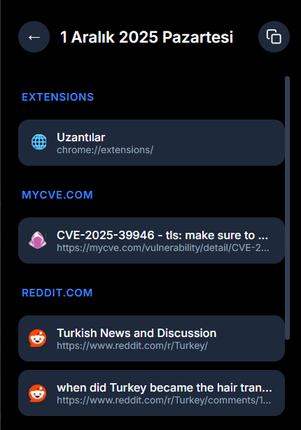
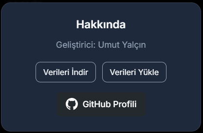

# Seçtiğiniz sekmeleri düzenli bir şekilde klasörde tutmak için Chrome Web eklentisi / Chrome Web extension to keep your selected tabs organized in a folder

    

---

## Eklenti ile alakalı ekran görüntüleri / Screenshots related to the extension

    
    
    

---

### Proje Hakkında 

Araştırma yaparken veya çalışırken açık kalan sekmeler bilgisayarı yavaşlatır. Bu eklenti açık olan sekmelerinizi tek bir tıklamayla o günün tarihiyle yer imlerinize kaydeder ve sekmeleri kapatarak sistemin az kaynak kullanmasını sağlar.

* **Tarihli Arşivleme:** Sekmeleri `2025-12-01 Arşivi` gibi klasörler halinde gruplar.
* **Performans Artışı:** Arşivlenen sekmeleri otomatik kapatarak RAM kullanımını azaltır.
* **Kolay Geri Dönüş:** Günler sonra bile hangi gün hangi kaynakları incelediğinizi geçmiş klasöründen bulabilirsiniz.

Özellikle çok fazla sekmeyle çalışanlar için çok işe yarayacak birr eklentidir.

---

### About the Project 

Open tabs while researching or working slow down the computer. This extension saves your open tabs into your bookmarks with the current day's date with a single click, and closes the tabs to ensure the system uses fewer resources.

* **Dated Archives:** Organizes tabs into folders like `2025-12-01 Archive`.
* **Resource Friendly:** Closes archived tabs instantly to free up RAM.
* **Easy Retrieval:** Quickly find which resources you were reading on a specific day, even weeks later.

It is a highly useful extension, especially for those who work with too many tabs.

---

## Proje Teknolojileri: / Project Technologies:

    

---
## Ek Bilgiler / Additional Information

* Eğer bir sayfayı kaydetten çıkarmak istiyorsanız aynı sayfadayken tekrar kaydet kısmına tıklamanız yeterlidir.
* If you want to unsave a page, simply click the save button again while on the same page.

---

Eklenecekler / To Be Added: Chrome Web Mağazasına eklenecek ve link buradaki README dosyasına eklenecek. Eğer mağazaya yüklenmeden kullanmak istiyorsanız, gerekli ayarlar ile yerel olarak kullanabilirsiniz. / Will be added to the Chrome Web Store, and the link will be added to this README file. If you want to use it without store installation, you can run it locally with the necessary settings.
