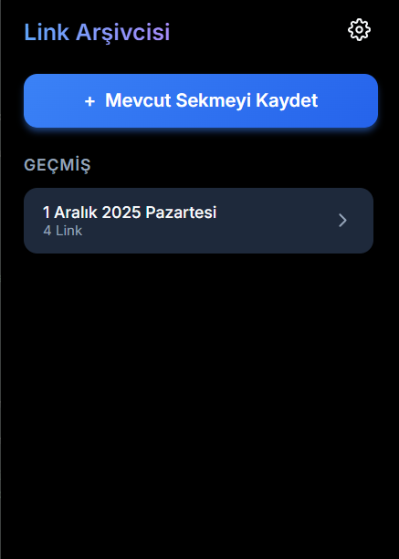

# Seçtiğiniz sekmeleri düzenli bir şekilde klasörde tutmak için Chrome Web eklentisi / Chrome Web extension to keep selected tabs in a folder day by day

    

---

## Eklenti ile alakalı ekran görüntüleri / Screenshots related to the extension

    
    
    

---

### Proje Hakkında 

Araştırma yaparken veya çalışırken açık kalan sekmeler bilgisayarı yavaşlatır. Bu eklenti açık olan sekmelerinizi tek bir tıklamayla o günün tarihiyle yer imlerinize kaydeder ve sekmeleri kapatarak sistemin az kaynak kullanmasını sağlar.

* **Tarihli Arşivleme:** Sekmeleri `2025-12-01 Arşivi` gibi klasörler halinde gruplar.
* **Performans Artışı:** Arşivlenen sekmeleri otomatik kapatarak RAM kullanımını azaltır.
* **Kolay Geri Dönüş:** Günler sonra bile hangi gün hangi kaynakları incelediğinizi geçmiş klasöründen bulabilirsiniz.

Özellikle çok fazla sekmeyle çalışanlar için çok işe yarayacak birr eklentidir.

---

### About the Project 

Having dozens of open tabs during research or coding drags down system performance and causes clutter. Daily Tab Archiver saves your open tabs into a dated bookmark folder with a single click, then closes them to free up memory.

* **Dated Archives:** Organizes tabs into daily folders like `2025-12-01 Archive`.
* **Resource Friendly:** Closes archived tabs instantly to free up RAM.
* **Easy Retrieval:** Quickly find which resources you were reading on a specific day, even weeks later.

A lightweight productivity tool built for developers, students, and researchers who juggle multiple tabs.

---

## Proje Teknolojileri: / Project Technologies:

    

---
## Ek Bilgiler / Additional Information

* Eğer bir sayfayı kaydetten çıkarmak istiyorsanız aynı sayfadayken tekrar kaydet kısmına tıklamanız yeterlidir.
* If you want to unsave page, simply click the save button again while on the same page.

---

Eklenecekler / To Be Added: Chrome Extensions sayfasına eklenecek ve link readme. dosyasına eklenecek. Eğer Web sayfasına yüklenmeden kullanmak istiyorsanız gerekli ayarlar ile yerel bir şekilde kullanabilirsiniz.
